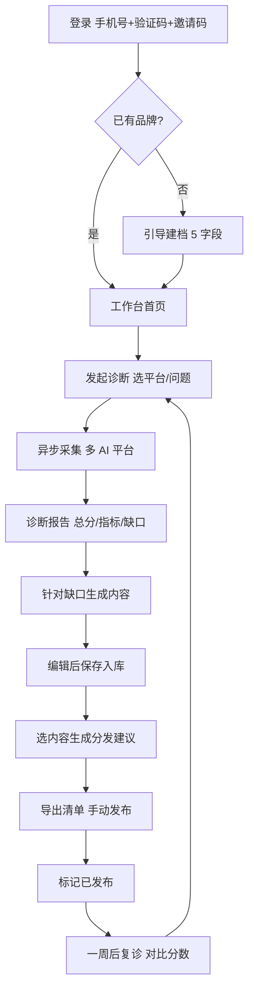
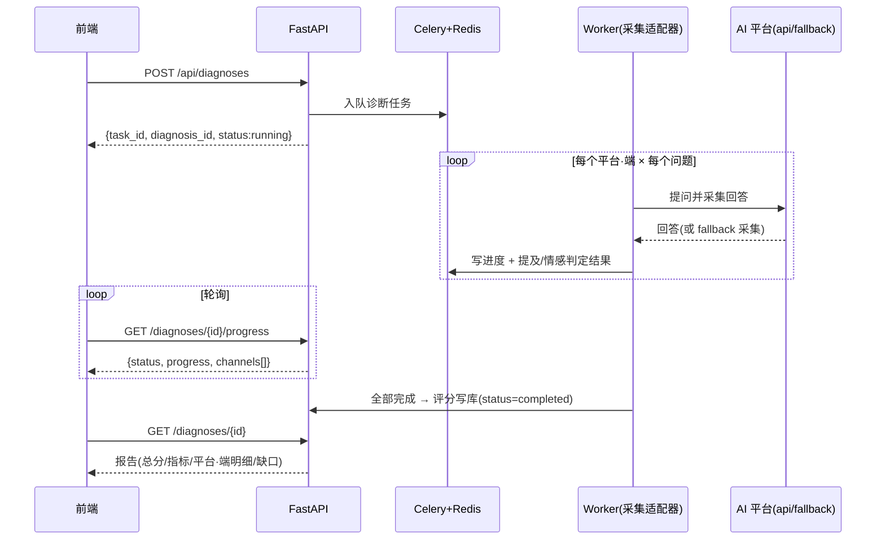

# AnswerOne · 首答 ｜ V1 PRD

> 产品需求文档（V1 · 内部对齐版）
---

## 0. 文档说明

本文档定义 **AnswerOne（中文名：首答）** 第一个可上线版本（V1）的产品需求。目标读者是项目内部的产品、设计、研发，以及合伙人共识所需的关键决策者。

本 PRD 解决的核心问题是：**第一批培训学员，怎么用 AnswerOne 在 AI 里被看见、被推荐。**

V1 不追求完美和全自动，**追求"够用、能跑、能让学员当堂做出第一批 GEO 效果"**。

---

## 1. 产品定位

### 1.1 一句话定义

**AnswerOne 是一款配套 GEO 培训使用的 Web 工作台，帮助学员把 GEO 这件事真正做下来——从诊断现状、生成内容，到拿到分发建议。**

### 1.2 设计理念

- **配培训用，不独立运转**：V1 不是一个面向公开市场的 SaaS，而是培训交付链路里的"实操工具"。学员上完一节课，进 AnswerOne 把这节课的作业做掉。
- **任务流水线 × 个人工作台**：核心三大流程（诊断 / 生成 / 分发）做成"傻瓜流水线"——学员按步骤填、按按钮、拿结果；同时所有产出沉淀在个人工作台里，形成"我的 GEO 资产"。
- **让学员当堂出效果**：每个流程都要在合理时间内（诊断 ≤5 分钟、生成 ≤2 分钟、分发建议即时）跑完，让学员"看得见结果"。

### 1.3 不做什么（V1 边界）

明确**不在 V1 范围**内的：

- ❌ 自动分发（不替学员发到任何平台）
- ❌ 团队协作（一人一号，不做多人共编、不做角色权限）
- ❌ 复购订阅、计费、提现等付费体系
- ❌ 移动端 App、小程序
- ❌ 公开注册和营销官网
- ❌ 大B 企业的多账户管理 / 白标（学员个人维护多个品牌已纳入 V1，见 3.4.2）

---

## 2. 用户与场景

### 2.1 目标用户

**V1 唯一目标用户：第一期付费培训学员。**

学员画像（基于业务定调推断，⚠️ 实际开课后需校准）：
- 身份：个人创业者 / 小型门店主 / 本地服务从业者 / 中小品牌负责人
- 技术水平：**不懂技术、不会写代码**，但能熟练用微信、淘宝、抖音
- 设备：主要用电脑上课，偶尔用手机查看
- 学习节奏：跟着课程进度，一周 1-2 节课

### 2.2 核心场景

**场景一：第一次诊断**
> 学员上完"诊断"这节课，老师布置作业："去 AnswerOne 给你的品牌做一次诊断"。
> 学员登录、填写品牌信息、点"开始诊断"，几分钟后看到一份报告："你在豆包·手机版里被提及 0 次、千问·网页版里 2 次……"——学员第一次看清自己在 AI 里的真实状态。

**场景二：内容生成**
> 学员看完诊断报告，发现"附近哪家奶茶好喝" 这个高频问题里没有自己。
> 在 AnswerOne 点"针对这个缺口生成内容"，AI 帮她写出 3 篇小红书笔记初稿。学员稍作修改，准备发布。

**场景三：分发建议**
> 学员有了内容，不知道发到哪。
> AnswerOne 根据她的目标 AI 平台和内容类型，给出建议："这 3 篇笔记建议发到小红书 + 知乎 + 大众点评，按这个标题、用这些标签。" 学员复制走、手动发布。

**场景四：复诊（V1 简化版）**
> 一周后，学员想看效果有没有变化。
> 重新点一次"诊断"，对比前后两份报告。

---

## 3. 核心功能

V1 三大功能模块：**诊断 / 生成 / 分发建议**，外加支撑性的**工作台主页和品牌档案**。

### 3.1 模块一 · 诊断（D - Diagnosis）

**目标**：让学员一键看清"我在 AI 里的现状"。

#### 3.1.1 输入

学员需要提供：
- 品牌名称（必填，可改）
- 品牌一句话描述（必填，用于生成提问）
- 行业 / 品类（从预设列表选）
- 业务区域：全国 / 某城市 / 某商圈（用于本地相关提问）
- （V1 建议：系统先按行业自动生成 10 个高频提问，学员可改、可增删）

#### 3.1.2 处理

系统执行流程：
1. 根据品牌信息 + 行业 + 区域，**自动生成一组"用户可能向 AI 问的问题"**（V1 默认 10 个，覆盖通用咨询、对比推荐、本地查询等）
2. 将这组问题**逐一发送给所选的多个 AI 平台·端**
3. 收集每个 AI 的回答
4. 在每个回答里，**检测品牌名是否被提及、提及位置、上下文情感**
5. 汇总成报告

** V1 接入的 AI 平台·端**（8 个平台 × 手机/网页端，共 12 个平台·端）：
- 千问·手机版、千问·网页版、豆包·手机版、豆包·网页版、DeepSeek·手机版、DeepSeek·网页版、腾讯元宝·手机版、腾讯元宝·网页版、文心·网页版、KIMI·网页版、百度AI·网页版、AI抖音·网页版
- 同一平台的手机版 / 网页版联网来源不同（生态型平台尤其明显），分开统计；选择标准：用户基数大、行业相关

#### 3.1.3 输出

**一份《GEO 诊断报告》**，包含：
- **总分**：综合 0-100 分（提及率 × 排名 × 情感 加权）
- **三项关键指标**：提及率、平均提及位置、正面情感率
- **上榜要素诊断**：「被检索 → 被引用 → 优先推荐」可见度漏斗，外加 5 个公开研究验证的上榜要素评分（相关性 / 具体性 / 权威引用 / 内容长度 / 第三方提及），解释"为什么被/不被引用"并导向生成建议（打分模型见 §9.2）
- **平台·端明细**：每个 AI 平台·端单独的提及次数、问题清单、回答原文摘录
- **缺口诊断**：哪些问题/平台·端里完全 0 提及（标红，作为下一步"生成"的输入）
- 报告支持**在线查看 + 下载 PDF**

#### 3.1.4 关键体验

- 学员点"开始诊断"后看到**进度条**（"正在询问豆包·手机版… 3/10"），避免黑盒等待
- 单次诊断时间 ≤ 5 分钟（V1 可放宽到 10 分钟）
- 诊断历史保留，方便复诊对比

---

### 3.2 模块二 · 生成（G - Generation）

**目标**：针对诊断出的缺口，帮学员产出 AI 愿意引用的内容。

#### 3.2.1 输入

两种触发路径：
- **路径 A · 从诊断进入**（推荐）：学员在诊断报告里点某个缺口（如"附近哪家奶茶好"0 提及），系统自动带入这个问题作为生成上下文
- **路径 B · 直接进入**：学员手动选"我要生成内容"，自己输入主题、目标问题

学员需要选择内容形态（V1 支持三类，均产出**可下载的成品**）：
- **文字**：标题 + 正文 + 标签的图文稿（800-1500 字，小红书 / 知乎 / 问答风格），可附配图建议
  - 调性：专业 / 亲切 / 干货 / 故事；单次 1-5 篇
- **图片**：AI 文生图成品
  - 画面风格：写实摄影 / 小清新 / 手绘插画 / 海报排版；比例：1:1 / 3:4 / 16:9；单次 1-4 张
- **视频**：AI 文生视频成品 + 配套分镜脚本
  - 时长：15 / 30 / 60 秒；比例：竖屏 9:16 / 横屏 16:9；风格：实拍感 / 卡通动画；单次 1-2 条

#### 3.2.2 处理

系统执行：
1. 基于品牌档案 + 目标问题，先用**大模型生成创意脚本/提示词**（文字稿、图片画面描述、视频分镜与口播）
2. 应用 GEO 优化策略（V1 内置一套提示词模板）：
   - 加入容易被 AI 引用的结构（清单、对比、明确推荐）
   - 嵌入品牌名 + 关键卖点的自然提及
   - 符合目标平台的写作习惯
3. 按形态产出成品：
   - 文字：直接返回稿件
   - 图片：调用**文生图模型**按画面描述出图（1-4 张）
   - 视频：调用**文生视频模型**按分镜生成成品视频 + 封面，并保留可编辑脚本
4. 图片 / 视频成品过一遍**内容安全审核**后入库

#### 3.2.3 输出

- **生成产物**（按形态）：
  - 文字：标题 + 正文 + 推荐标签 + 配图建议，可在线编辑
  - 图片：1-4 张成品图（可下载 / 单张重生成），含画面描述与图注
  - 视频：成品视频（可下载 / 重生成）+ 封面 + 分镜脚本（口播 / 字幕，可编辑）
- 所有产物沉淀在"我的内容库"，按形态展示（图片显缩略图、视频显封面 + 时长）

#### 3.2.4 关键体验

- 学员从诊断进入生成时，**自动带入上下文**（"针对'附近奶茶'这个 0 提及问题，生成 3 篇内容"），不用重新填
- 生成耗时按形态不同：文字 ≤ 2 分钟/篇、图片约 30 秒/张、视频约 3-5 分钟/条；图片 / 视频走**异步任务**，生成中可离开本页，完成后在内容库查看
- 内容编辑器要轻，类似简化版 Notion，**不要 Word 那套复杂格式工具栏**

---

### 3.3 模块三 · 分发建议（R - Routing）

**目标**：告诉学员"这些内容，去哪发、怎么发"。**V1 不做自动发布。**

#### 3.3.1 输入

- 学员在"我的内容库"选 1 篇或多篇内容
- 点"生成分发建议"

#### 3.3.2 处理

系统根据：
- 内容类型（图文/问答/脚本）
- 诊断结果中"哪些 AI 平台偏好什么信源"的映射表
- 内容主题

给出建议。

#### 3.3.3 输出

一份**《分发建议清单》**，对每篇内容给出：
- **推荐发布平台**（按优先级排序，3-5 个）
- 每个平台的**适配建议**：标题怎么改、标签加什么、首图建议
- **发布顺序建议**（如：先发知乎建立权威、再发小红书引流）
- **复诊提醒**：发布后建议 X 天回 AnswerOne 复诊

清单支持**导出为表格（Excel / 飞书文档）**，学员按表格逐一手动发布。

#### 3.3.4 关键体验

- **不假装能自动发**——明确告诉学员"复制走、手动发"，不让学员误以为发了
- 提供"复制到剪贴板"按钮（标题、正文、标签一键复制）
- 每篇内容标记发布状态：**待发布 / 已发布**（学员手动勾选，作为复诊的对比依据）

---

### 3.4 支撑模块 · 工作台与品牌档案

#### 3.4.1 工作台主页（学员登录后第一屏）

布局：左侧主导航 + 主内容区。

主导航：
- 工作台首页
- 品牌档案
- 我的诊断
- 我的内容库
- 我的分发计划
- 帮助/课程入口

工作台首页展示：
- **当前进度卡**："你已完成诊断 ✓ ｜ 已生成 3 篇内容 ｜ 0 篇已发布"
- **最近一次诊断分数**：大数字 + 简短建议
- **下一步建议**：根据当前状态，给一个明确的 CTA（如"建议生成 5 篇内容补缺口"）
- **课程进度联动**：V1 不做（与培训系统无任何联动；课程通过外部入口跳转，本系统内不呈现课程进度）

#### 3.4.2 品牌档案

学员的品牌信息中心，每个品牌一份档案：
- 品牌名、描述、行业、区域、关键卖点
- 目标 AI 平台勾选
- 用户提问样本管理（系统生成 + 学员手动补充）
- 一处修改、该品牌各模块复用

V1 支持**一人维护多个品牌**：本页可新建 / 编辑 / 删除品牌；通过侧栏「品牌切换器」切换当前工作区品牌，工作台与诊断 / 生成 / 分发均作用于当前品牌。各品牌的诊断、内容、分发互相独立、互不串数据。

> 这里的「多品牌」是**学员个人维护自己的多个品牌**（如同时运营两家门店）；与 V3 的「大 B 企业版多账号 / 白标」是两回事，后者不在 V1。

---

## 4. 用户主流程

V1 主流程（学员视角，黄金路径）：

```
登录
  ↓
首次登录 → 引导填品牌档案（5 字段，2 分钟搞定）
  ↓
进入工作台首页 → 看到"建议先做诊断"
  ↓
进入诊断 → 一键开始 → 等 5 分钟 → 看到诊断报告
  ↓
报告里点"针对缺口生成内容" → 进入生成模块（带入上下文）
  ↓
生成 3 篇内容 → 编辑/调整 → 保存到内容库
  ↓
进入分发建议 → 选内容 → 拿到分发清单
  ↓
学员复制走、手动发布 → 在 AnswerOne 标记"已发布"
  ↓
（一周后）回到诊断 → 复诊 → 看分数变化
```

整个流程**学员第一次走完，目标控制在 30 分钟内**（其中诊断等待 5 分钟，其余都是阅读和复制粘贴）。

---

## 5. 信息架构与页面清单

V1 总共约 **9 个核心页面**：

| 序号 | 页面 | 主要内容 |
|---|---|---|
| 1 | 登录页 | 手机号 + 验证码 / 邀请码 |
| 2 | 引导页（首次登录） | 填品牌档案 5 字段 |
| 3 | 工作台首页 | 进度卡、最近诊断、下一步建议 |
| 4 | 品牌档案页 | 查看/编辑品牌信息、提问样本 |
| 5 | 诊断列表页 | 历次诊断记录 |
| 6 | 诊断详情页 | 一份完整诊断报告 |
| 7 | 内容生成页 | 输入参数 + 生成结果 + 编辑 |
| 8 | 内容库页 | 所有生成内容列表 + 状态管理 |
| 9 | 分发建议页 | 分发清单 + 导出 |

辅助页面：帮助中心 / 课程入口（多半 iframe 嵌入培训系统）。

---

## 6. 技术与外部依赖

> 本节给开发参考用，不约束具体实现，⚠️ 标识处需要技术负责人评估后定。

### 6.1 技术栈建议

- **前端**：Vue 3 + TypeScript + Tailwind（SDD Harness 规范，已与用户确认；不接受替换为 React）
- **后端**：Python 3.11+ / FastAPI / PyCore（SDD Harness 规范，已与用户确认；不接受替换为 Node）
- **数据库**：PostgreSQL + Redis（缓存 AI 回答、降低重复调用成本）
- **大模型调用**：通过 OpenRouter 等聚合 API 接入多家，或直连各家官方 API
- **任务队列**：Celery / BullMQ（诊断是异步任务，必须排队处理）
- **部署**：国内云（阿里云/腾讯云），保证学员访问速度

### 6.2 关键外部依赖

- **多家 AI 平台 API**：⚠️ V1 启动前需技术调研：哪些有公开 API、调用频率限制、费用、稳定性。无 API 的平台 V1 暂不接入。
- **大模型 API**（文字稿 / 图片画面描述 / 视频分镜）：建议优先 DeepSeek / 通义 等国内大模型，性价比和合规都更好
- **文生图模型**（图片成品）：如通义万相 / 即梦，按张计费
- **文生视频模型**（视频成品）：如可灵 / 即梦 / 通义，按时长 / 条计费，单条耗时分钟级，是生成链路里最慢、最贵的一环
- **短信验证码服务**：阿里云 / 腾讯云短信
- **对象存储**：用于诊断报告 PDF、图片 / 视频成品与封面、内容附件

### 6.3 风险与成本提示

- **AI 平台 API 不稳定**：部分平台限流严、断断续续，需做好重试和降级
- **token 消耗**：单次诊断估算消耗 50-200K token（10 个问题 × 多个平台），需提前测算预算
- **图片 / 视频生成成本与时延**：文生图按张、文生视频按时长计费，**视频是成本与等待最高的一环**（单条分钟级）。V1 须对单次份数限流（图片 ≤4、视频 ≤2、视频时长 ≤60 秒）并预估预算，避免学员误以为可无限量出片
- **内容审核**：文字 / 图片 / 视频成品上线前都需接入内容安全 API（阿里云/腾讯云）；图片视频尤其要做，未通过的产物不入库，这会再增加少量时延
- **数据隐私**：学员品牌数据要做基本的访问隔离，⚠️ V1 不需要等保，但要做到一人一号、互不可见

---

## 7. V1 范围边界确认

### 必须在 V1 完成（MUST）
- 三大核心功能（诊断/生成/分发建议）的最小可用路径
- 工作台主页 + 品牌档案
- 学员账号体系（注册登录）
- 诊断报告 PDF 导出
- 分发清单 Excel/表格导出

### V1 可以妥协的（COULD）
- 诊断报告样式不必精美，能看懂即可
- 内容编辑器用现成组件（如 TipTap），不自研
- 分发建议可以是"模板化"而非真正智能的（V2 再迭代）
- 图片 / 视频生成在 V1 即落地，但**单次份数与时长受限**（图片 ≤4、视频 ≤2、时长 ≤60 秒），出片质量依赖第三方文生图 / 文生视频模型；更高规格、批量出片留待 V2

### V1 明确不做（WON'T）
- 自动发布到任何平台
- 多人协作 / 团队空间
- 复购、订阅、付费体系
- 数据看板 / 趋势分析
- 移动端 App / 小程序
- 公开注册（V1 走邀请码，仅向培训学员开放）

---

## 8. 后续版本规划（指引性，不约束）

**V2**
- 数据看板：分数趋势、复诊对比、内容效果统计
- 内容编辑器升级：模板库、批量生成、更高规格图片 / 视频（更长时长、更多份数）
- 微信小程序入口（用于查看报告、接收提醒）

> 多品牌（学员个人维护多个品牌）已提前纳入 V1，见 3.4.2 / 9.1。
> 图片 / 视频成品生成已纳入 V1（受份数 / 时长限制），见 3.2。

**V3**
- 半自动分发：接入有 API 的平台一键发布（先从公众号/头条等容易合规的平台开始）
- 大B 企业版：多账号管理、白标、API 输出

**V·**
- 真正的 Agent 化：用户用自然语言对话，系统自动拆解任务、规划、执行

---

## 9. 数据契约（V1 锁定 · 全项目唯一真相，不随版本变化）

> 本节为产品设计 A5 产出。开发阶段 `api-contracts.md` 与数据库设计必须以本节为准；数据契约一次定全，不随 V1/V2 增减字段。

### 9.1 核心实体与关系

```text
学员账号 User
  ├─ current_brand_id ─────────────→ 指向当前选中品牌（多品牌工作区切换）
  └─ 1:N 品牌档案 Brand            [V1 一人可建多个品牌]
        ├─ 1:N 诊断 Diagnosis
        │      ├─ 1:N 诊断问题 Question
        │      └─ 1:N 提及结果 Mention     [问题 × 平台·端]
        ├─ 1:N 内容 Content
        └─ 1:N 分发建议 Routing           [关联 1~N 篇 Content]
```

> 一人一号、一个号下可建多个品牌；每个品牌各自独立维护诊断 / 内容 / 分发。`User.current_brand_id` 标记当前工作区品牌，工作台与三大流程默认作用于当前品牌。

### 9.2 实体字段

#### User（学员账号）

| 字段 | 类型 | 说明 |
|---|---|---|
| id | string | 主键 |
| phone | string | 手机号，登录标识 |
| invite_code | string | 注册邀请码（V1 邀请制） |
| nickname | string? | 昵称，可空 |
| current_brand_id | string? | 当前选中品牌（多品牌工作区切换；无品牌时为空） |
| created_at / last_login_at | datetime | 创建 / 最近登录 |

> V1 不做课程进度联动，User 不含任何课程相关字段。

#### Brand（品牌档案，1 用户 N 条）

| 字段 | 类型 | 说明 |
|---|---|---|
| id / user_id | string | 主键 / 所属用户 |
| name | string | 品牌名称（必填） |
| slogan | string | 一句话描述（必填，用于生成提问） |
| industry | enum | 行业/品类（见 9.3） |
| region_type | enum | 全国 / 城市 / 商圈 |
| region_value | string? | 区域具体值（城市名 / 商圈名） |
| selling_points | string[] | 关键卖点 |
| target_channels | enum[] | 目标 AI 平台·端（channel 复合值，见 9.3） |
| created_at / updated_at | datetime | 创建 / 更新（品牌列表排序用） |

> 一个 user_id 下可有多条 Brand；删除某品牌即连带删除其名下诊断 / 内容 / 分发（危险操作需二次确认）。当前品牌由 `User.current_brand_id` 指向，不在 Brand 上重复标记。

#### Question（诊断问题，属于一次诊断）

| 字段 | 类型 | 说明 |
|---|---|---|
| id / diagnosis_id | string | 主键 / 所属诊断 |
| text | string | 问题文本 |
| type | enum | 通用咨询 / 对比推荐 / 本地查询 |
| source | enum | 系统生成 / 用户添加 |

#### Diagnosis（诊断记录）

| 字段 | 类型 | 说明 |
|---|---|---|
| id / brand_id | string | 主键 / 所属品牌 |
| status | enum | 进行中 / 已完成 / 失败 |
| channels | enum[] | 本次目标平台·端（channel 复合值） |
| progress | string | 进度，如 "3/10" |
| score_total | int (0-100) | 总分 |
| metric_mention_rate | float | 提及率 |
| metric_avg_position | float | 平均提及位置 |
| metric_positive_rate | float | 正面情感率 |
| created_at / finished_at | datetime | 创建 / 完成 |

> 总分算法（V1）：`score_total = 提及率分×0.5 + 位置分×0.3 + 情感分×0.2`，三项均归一到 0-100；后期可优化。

> **上榜要素与可见度漏斗（V1 报告打分模型，依据公开 GEO 研究）**
> 诊断报告在三项指标之外，额外给出「被检索 → 被引用 → 优先推荐」可见度漏斗与 5 个上榜要素评分，用于解释"为什么被/不被引用"并直接导向生成建议。落在报告 payload（见 api-contracts `citation_funnel` / `citation_factors`），不单独建表。
>
> - **可见度漏斗 citation_funnel**：`retrieved_rate`（被检索率）→ `cited_rate`（被引用率，= 提及率）→ `top3_rate`（优先推荐率，进前 3），并给出相邻两步转化。研究表明**被检索 ≠ 被引用**——被 AI 检索到的页面仅约 15% 最终被引用，引用是真正关口。
> - **5 个上榜要素 citation_factors**（每项含 `level` weak/medium/strong、`score` 0-100、`impact` 研究提升幅度、`note` 诊断说明）：
>   1. **相关性 relevance** — 内容是否答到用户真正在问的问题，是能否上榜的第一预测因子。
>   2. **具体性 specificity** — 含真实数据/价格/对比/步骤约 +50%；纯 FAQ 堆砌反而有害。
>   3. **权威引用 authority** — 权威引用约 +115%、可信直接引述 +43%、相关统计 +33%。
>   4. **内容长度 length** — 甜区 1000–3000 词、10+ 小标题；过短几乎进不了引用池。
>   5. **第三方提及 third_party** — 站外被提及被引用概率约为自有域的 6.5×；按可信度分三档 `breakdown`：`self`（自有渠道）< `third_party_owned`（学员发到站外平台的内容）< `third_party_organic`（他人自发提及）。

#### Mention（提及结果，问题 × 平台·端明细）

| 字段 | 类型 | 说明 |
|---|---|---|
| id / diagnosis_id / question_id | string | 主键 / 所属诊断 / 所属问题 |
| channel | enum | 平台·端（复合值，如 `doubao_mobile`） |
| platform / device | enum | 平台 / 端（由 channel 拆出，便于按平台聚合手机·网页） |
| answer_excerpt | text | 回答原文摘录 |
| mentioned | bool | 是否提及品牌 |
| position | int? | 提及位置（回答中的序位，未提及为空） |
| sentiment | enum | 正面 / 中性 / 负面 |
| source_method | enum | api / fallback（无 API 时备用算法采集） |

#### Content（内容）

| 字段 | 类型 | 说明 |
|---|---|---|
| id / brand_id | string | 主键 / 所属品牌 |
| title | string | 标题 |
| content_type | enum | 文字 / 图片 / 视频 |
| body | text | 正文（仅文字） |
| tags | string[] | 推荐标签（仅文字） |
| image_suggestion | text | 配图建议文字（仅文字） |
| image_prompt | text | 画面描述（仅图片，可编辑） |
| images | object[] | 图片成品（仅图片）：每项 url / ratio / caption / overlay_text |
| video | object | 视频成品（仅视频）：url / cover_url / duration_sec / ratio / style / script[] |
| gen_params | object | 生成参数快照（类型 + 风格 / 比例 / 时长 / 调性等） |
| tone | enum | 调性（仅文字）：专业 / 亲切 / 干货 / 故事 |
| source_question_id | string? | 来源诊断缺口（可空，直接生成时为空） |
| publish_status | enum | 待发布 / 已发布（用户手动勾选） |
| created_at / updated_at | datetime | 创建 / 更新 |

> `video.script[]` 每项：shot（镜号）/ scene（画面）/ start_sec / end_sec / voiceover（口播）/ subtitle（字幕）。
> 图片 / 视频走异步生成：任务完成后才创建本记录（待发布），生成接口见 api-contracts `POST /api/contents/generate` + `GET /api/contents/generate/{task_id}`。
> V1 不单设草稿态，生成后直接入库、可随时编辑。

#### Routing（分发建议）

| 字段 | 类型 | 说明 |
|---|---|---|
| id / brand_id | string | 主键 / 所属品牌 |
| content_ids | string[] | 关联内容（1~N 篇） |
| platform_suggestions | object[] | 每平台：平台名 / 优先级 / 标题建议 / 标签建议 / 首图建议 |
| publish_order | string | 发布顺序建议 |
| recheck_after_days | int | 复诊提醒天数 |

### 9.3 枚举字典

| 枚举 | 取值 |
|---|---|
| content_type 内容类型 | 文字 / 图片 / 视频 |
| tone 内容调性（仅文字） | 专业 / 亲切 / 干货 / 故事 |
| image_style 画面风格 | 写实摄影 / 小清新 / 手绘插画 / 海报排版 |
| image_ratio 图片比例 | 1:1 / 3:4 / 16:9 |
| video_duration 视频时长 | 15 / 30 / 60 秒 |
| video_ratio 视频比例 | 竖屏 9:16 / 横屏 16:9 |
| video_style 视频风格 | 实拍感 / 卡通动画 |
| gen_task_status 生成任务状态 | 排队中 / 生成中 / 已完成 / 部分成功 / 失败 |
| region_type 业务区域 | 全国 / 城市 / 商圈 |
| question.type 问题类型 | 通用咨询 / 对比推荐 / 本地查询 |
| sentiment 情感 | 正面 / 中性 / 负面 |
| diagnosis.status 诊断状态 | 进行中 / 已完成 / 失败 |
| publish_status 内容发布状态 | 待发布 / 已发布 |
| source_method 采集方式 | api（官方 API） / fallback（无 API 备用算法） |

**AI 平台 platform（8 个）**：`qwen` 千问 / `baidu` 百度AI / `doubao` 豆包 / `yuanbao` 腾讯元宝 / `douyin` AI抖音 / `kimi` KIMI / `deepseek` DeepSeek / `wenxin` 文心

**端 device（2 个）**：`mobile` 手机版 / `web` 网页版

**AI 平台·端 channel（复合值 `<platform>_<device>`，V1 全部纳入 12 个）**：千问·手机版 `qwen_mobile` / 千问·网页版 `qwen_web` / 豆包·手机版 `doubao_mobile` / 豆包·网页版 `doubao_web` / DeepSeek·手机版 `deepseek_mobile` / DeepSeek·网页版 `deepseek_web` / 腾讯元宝·手机版 `yuanbao_mobile` / 腾讯元宝·网页版 `yuanbao_web` / 文心·网页版 `wenxin_web` / KIMI·网页版 `kimi_web` / 百度AI·网页版 `baidu_web` / AI抖音·网页版 `douyin_web`

> 同一平台的手机版 / 网页版联网来源不同（生态型平台如 AI抖音/百度AI/腾讯元宝尤其明显），分开统计；并非每个平台都有两端。每个平台·端标记接入方式：有官方 API → `api`；无 API → `fallback`（备用采集算法，具体方案随技术调研在开发前确定）。平台·端与接入方式以数据库字典表维护，便于增删。

**行业/品类 industry（V1 · 本地生活服务版，可增删）**：

1. 餐饮（正餐 / 简餐）
2. 茶饮咖啡（奶茶 / 咖啡）
3. 烘焙甜点
4. 美容美发
5. 美甲美睫
6. 健身 / 瑜伽
7. 宠物服务（宠物店 / 宠物医院）
8. 家政保洁
9. 装修 / 家居
10. 汽车服务（洗车 / 维修 / 美容）
11. 口腔 / 医美
12. 婚纱摄影
13. 母婴 / 月子中心
14. 休闲娱乐（KTV / 桌游 / 密室）
15. 本地教培（少儿 / 艺术 / 技能）

### 9.4 状态流转

- 诊断：`创建 → 进行中 →（全部平台询问完成）已完成 ／（异常）失败`
- 内容：`生成 → 入库可编辑 → 待发布 →（用户手动勾选）已发布`

### 9.5 接口响应格式契约（全局统一）

- 成功：`{"code":200,"message":"success","data":{...}}`
- 错误：`{"code":<错误码>,"message":"<描述>","data":null}`
- 分页：`{"code":200,"data":{"items":[...],"total":100,"page":1,"page_size":20}}`
- 异步诊断：发起返回 `{"code":200,"data":{"task_id":"..."}}`；进度查询返回 `{"code":200,"data":{"status":"running","progress":"3/10"}}`
- HTTP 状态码：200 成功 / 400 参数错误 / 401 未认证 / 403 无权限 / 404 不存在 / 500 服务端错误

### 9.6 数据隔离

V1 一人一号，所有业务数据按 `user_id` 行级隔离，账号间互不可见（对应 PRD 6.3）。一个号下可建多个品牌，品牌及其名下诊断 / 内容 / 分发均挂 `brand_id`；工作台与三大流程默认按 `User.current_brand_id` 过滤，可显式指定 `brand_id` 覆盖，但服务端必须校验该 `brand_id` 归属当前 `user_id`，禁止跨用户、跨品牌读写。

---

## 10. 技术架构与交付蓝图（C 阶段定稿）

> 本节为产品设计 C 阶段产出，与已确认原型、`api-contracts.md`、`Plan.md` 一致。开发以本节 + 第 9 节为准。

### 10.1 路线图（终版）

| 版本 | 目标 | 关键范围 |
|---|---|---|
| **V1（本次开发）** | 让首期学员当堂跑出第一批 GEO 效果 | 诊断 / 生成 / 分发建议三大流程 + 工作台 + 品牌档案；生成支持文字 / 图片 / 视频三形态成品（份数·时长受限）；邀请制登录；PDF / Excel 导出；一人可建多个品牌、可切换 |
| V2 | 看见变化、提升效率 | 数据看板（分数趋势、复诊对比）、内容模板库与批量 / 更高规格图片视频、小程序查看入口 |
| V3 | 自动化与企业化 | 半自动分发（合规平台一键发布）、大 B 企业版（多账号、白标、API 输出） |
| V· | Agent 化 | 自然语言对话驱动任务拆解、规划、执行 |

V1 严格遵守第 7 节 MUST / COULD / WON'T 边界，不做自动发布、多人协作、付费体系、移动端 App、公开注册。

### 10.2 技术架构蓝图

**技术选型（已与用户锁定，不接受替换）**

| 层 | 选型 |
|---|---|
| 前端 | Vue 3 + TypeScript + Tailwind + Vite；Pinia 状态、Vue Router 路由、axios 请求；Mock 集中于 `frontend/src/mocks/`，由 `VITE_USE_MOCK` 切换真实/Mock |
| 后端 | Python 3.11+ / FastAPI / PyCore；分层 router → service → repository → model；统一响应格式中间件 |
| 异步 | Celery + Redis（broker/result）；诊断为异步任务，进度写 Redis，前端轮询 `GET /api/diagnoses/{id}/progress` |
| 数据库 | PostgreSQL（业务主库）+ Redis（AI 回答缓存、降低重复调用成本、进度状态） |
| 外部适配 | 多 AI 平台采集适配器（`api` / `fallback` 两类实现）、LLM 客户端（生成 + 提及/情感判定）、短信、对象存储；所有网络客户端 `httpx.Client(trust_env=False)`，禁止裸 `httpx.get/post` |
| 部署 | 国内云（阿里云 / 腾讯云）；Nginx 反代 + Uvicorn/Gunicorn 多 worker；PostgreSQL / Redis 托管实例；独立 Celery worker 进程 |

**分层与隔离**：所有业务查询强制带 `user_id` 过滤，实现行级隔离；敏感真实值仅进 `.env`，`docs/**`、`.sdd/**` 只记字段名与状态。

### 10.3 原型说明（界面对应关系）

原型目录：`docs/prototypes/`（Tailwind Play CDN + `assets/theme.js` 设计令牌 + `assets/app.js` 共享侧栏壳）。视觉系统：蓝色活力（渐变/玻璃/色块），主色锚定品牌蓝 `#2563EB`；内页流式铺满后居中（表格/表单上限 1280、仪表盘/卡片墙 1440），响应式适配 1280/1600/1920。

| 原型文件 | 页面 | 对应功能 | 主要接口 |
|---|---|---|---|
| `01-登录页.html` | 登录 | F01 | §模块1 |
| `02-引导建档.html` | 首次建第一个品牌 | F02 | §模块2 POST /api/brands |
| `03-工作台首页.html` | 工作台（当前品牌） | F04 | §模块6 GET /api/dashboard |
| `04-品牌档案.html` | 品牌档案 · 多品牌管理（列表/新建/切换/编辑） | F03 | §模块2 |
| `05-诊断列表.html` | 诊断列表 + 进度弹层 | F05 / F06 / F07 | §模块3 |
| `06-诊断详情.html` | 诊断报告 | F08 / F09 | §模块3 |
| `07-内容生成.html` | 内容生成 + 编辑器 | F10 / F11 | §模块4 |
| `08-内容库.html` | 内容库 | F12 / F15 | §模块4 |
| `09-分发建议.html` | 分发建议 | F13 / F14 / F15 | §模块5 |

### 10.4 核心流程图

**黄金路径（学员主流程）**



**异步诊断时序**



### 10.5 组件交互说明

**新增后端模块（对应 Plan.md 后端清单）**：基础设施 B00、认证 B01、字典 B02、品牌档案 B03、诊断引擎 B04、报告/PDF B05、内容生成/内容库 B06、分发/导出 B07、工作台聚合 B08。

**关键调用关系**：
- 品牌档案 B03 管理一人名下的多个品牌（增删改查 + 切换 `User.current_brand_id`）；其余模块均在当前品牌（或显式 `brand_id`）上下文内工作，并校验品牌归属当前用户。
- 工作台聚合 B08 读取诊断 B04/B05、内容 B06、分发 B07 的汇总（按当前品牌过滤），不写业务数据。
- 诊断引擎 B04 依赖品牌档案 B03（取目标平台与提问样本），调用平台采集适配器（`api`/`fallback`）与 LLM（提及/情感判定），结果经评分写库。
- 内容生成 B06 依赖品牌档案 B03 与诊断缺口（`source_question_id`）；文字直接返回，图片 / 视频走异步任务（LLM 出脚本/画面描述 → 文生图 / 文生视频出成品 → 内容审核），完成后入库（无独立草稿态）。
- 分发建议 B07 依赖内容 B06，输出发布渠道建议（知乎/小红书/大众点评等，与诊断的 AI 平台是两类对象）。
- 提问样本池：品牌级可编辑列表，发起诊断时快照成该次诊断的 Question 记录（第 9.2 节 Question 隶属 Diagnosis）。

### 10.6 技术选型与风险

| 风险 | 影响 | 缓解 |
|---|---|---|
| 部分 AI 平台无公开 API / 限流不稳 | 诊断采集失败或不全 | 采集适配器分 `api`/`fallback` 两类；失败重试 + 降级 `source_method=fallback`；结果如实标注，不伪装真实联调 |
| LLM token 消耗（单次诊断 50–200K） | 成本与延迟 | Redis 缓存相同问题回答；问题数 V1 锁 10；诊断时间放宽至 ≤10 分钟 |
| 生成内容合规（含图片 / 视频） | 上线风险 | 图片 / 视频成品入库前必过内容安全审核，未通过不入库；文字至少接文本安全 API |
| 图片 / 视频生成成本与时延 | 预算与体验 | 异步任务 + 进度轮询；单次份数限流（图片 ≤4、视频 ≤2、时长 ≤60s）；视频最慢最贵，需提前预估预算 |
| Python 3.9.6 与栈要求 3.11+ 不符 | 无法启动核心栈 | 进入开发前与用户对齐 Python 指令与 venv，完成升级（见 Plan.md §2.5） |
| 异步任务可靠性 | 诊断中断/卡死 | Celery 任务超时与重试；进度落 Redis；支持取消/重试 |

> 真实密钥只进 `.env`；外部服务测试权限缺失时只能标记降级验收，不得宣称真实外部服务联调通过。


